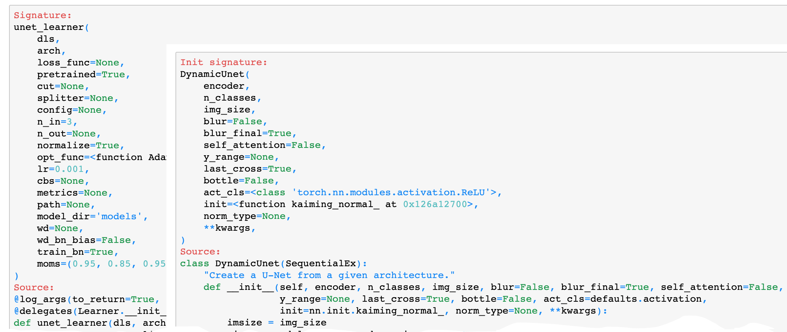

# Deploy FastAI Trained PyTorch Model in TorchServe and Host in Amazon SageMaker Inference Endpoint

- [Deploy FastAI Trained PyTorch Model in TorchServe and Host in Amazon SageMaker Inference Endpoint](#deploy-fastai-trained-pytorch-model-in-torchserve-and-host-in-amazon-sagemaker-inference-endpoint)
  - [Introduction](#introduction)
  - [Getting Started with A FastAI Model](#getting-started-with-a-fastai-model)
    - [Installation](#installation)
    - [Modelling](#modelling)
  - [PyTorch Transfer Modeling from FastAI](#pytorch-transfer-modeling-from-fastai)
    - [Export Model Weights from FastAI](#export-model-weights-from-fastai)
    - [PyTorch Model from FastAI Source Code](#pytorch-model-from-fastai-source-code)
    - [Weights Transfer](#weights-transfer)
  - [Deployment to TorchServe](#deployment-to-torchserve)
    - [Custom Handler](#custom-handler)
      - [`initialize`](#initialize)
      - [`preprocess`](#preprocess)
      - [`inference`](#inference)
      - [`postprocess`](#postprocess)
    - [TorchServe in Action](#torchserve-in-action)
  - [Deployment to Amazon SageMaker Inference Endpoint](#deployment-to-amazon-sagemaker-inference-endpoint)
    - [Getting Started with Amazon SageMaker Endpoint](#getting-started-with-amazon-sagemaker-endpoint)
    - [Real-time Inference with Python SDK](#real-time-inference-with-python-sdk)
    - [Clean up](#clean-up)
  - [Conclusion](#conclusion)
  - [Reference](#reference)

## Introduction

Over the past few years [FastAI](https://www.fast.ai/) has become one of the most cutting-edge and go-to choice for many machine learning use cases as an open-source Deep learning framework based on [PyTorch](https://pytorch.org/). It not only democratized deep learning and made it approachable to the general audiences, but also set as a role model on how scientific software shall be engineered especially in Python programming. Currently, however, to deploy a FastAI model to production environment often involves setting up and self-maintaining a customized inference solution, e.g. with [Flask](https://flask.palletsprojects.com/en/1.1.x/), which is time-consuming and distracting to manage and maintain issues like security, load balancing, services orchestration, etc.

Recently, AWS developed *[TorchServe](https://github.com/pytorch/serve)* in partnership with Facebook, which is a flexible and easy-to-use open-source tool for serving PyTorch models. It removes the heavy lifting of deploying and serving PyTorch models with Kubernetes, and AWS and Facebook will maintain and continue contributing to TorchServe along with the broader PyTorch community. With TorchServe, many features are out-of-the-box and they provide full flexibility of deploying trained PyTorch models at scale so that a trained model can go to production deployment with few extra lines of code.

Meanwhile, Amazon SageMaker endpoint has been a fully managed service that allows users to make real-time inferences via a REST API, and save Data Scientists and Machine Learning Engineers from managing their own server instances, load balancing, fault-tolerance, auto-scaling and model monitoring, etc. Amazon SageMaker endpoint provides different type of instances suitable for different tasks, including ones with GPU(s), which supports industry level machine learning inference and graphics-intensive applications while being [cost-effective](https://aws.amazon.com/sagemaker/pricing/).

In this repository we demonstrate how to deploy the FastAI trained pyTorch model in TorchServe eager mode and host it in Amazon SageMaker Inference endpoint.

## Getting Started with A FastAI Model

In this section we train a FastAI model that can solve a real-world problem with performance meeting the use-case specification. As an example, we focus on a **Scene Segmentation** use case from self-driving car.

### Installation

The first step is to install FastAI package, which is covered in it's [Github](https://github.com/fastai/fastai) repository.

> If you're using Anaconda then run:
> ```python
> conda install -c fastai -c pytorch -c anaconda fastai gh anaconda
> ```
> ...or if you're using miniconda) then run:
> ```python
> conda install -c fastai -c pytorch fastai
> ```

For other installation options, please refer to the FastAI documentation.

### Modelling

The following materials are based on the FastAI course: "[Practical Deep Learning for Coders](https://course.fast.ai/)".

First, import `fastai.vision` modules and download the sample data `CAMVID_TINY`, by:

```python
from fastai.vision.all import *
path = untar_data(URLs.CAMVID_TINY)
```

Secondly, define helper functions to calculate segmentation performance and read in segmentation mask for each training image.

**Note**: it's tempting to define one-line python `lambda` functions to pass to fastai, however, this will introduce issue on serialization when we want to export a FastAI model. Therefore we avoid using anonymous python functions during FastAI modeling steps.

```python
def acc_camvid(inp, targ, void_code=0):
    targ = targ.squeeze(1)
    mask = targ != void_code
    return (inp.argmax(dim=1)[mask] == targ[mask]).float().mean()

def get_y(o, path=path):
    return path / "labels" / f"{o.stem}_P{o.suffix}"
```

Thirdly, we setup the `DataLoader` which defines modelling path, training image path, batch size, mask path, mask code, etc. In this example we also record the image size and number of classes from the data. In real-world problem their values may be known in priori and shall be defined when constructing the dataset.

```python
dls = SegmentationDataLoaders.from_label_func(
    path,
    bs=8,
    fnames=get_image_files(path / "images"),
    label_func=get_y,
    codes=np.loadtxt(path / "codes.txt", dtype=str),
)
dls.one_batch()[0].shape[-2:], get_c(dls)
>>> (torch.Size([96, 128]), 32)
```

Next, setup a [U-Net](https://arxiv.org/abs/1505.04597) learner with a Residual Neural Network (ResNet) backbone, then trigger the FastAI training process.

```python
learn = unet_learner(dls, resnet50, metrics=acc_camvid)
learn.fine_tune(20)
>>>
epoch	train_loss	valid_loss	acc_camvid	time
0	3.901105	2.671725	0.419333	00:04
epoch	train_loss	valid_loss	acc_camvid	time
0	1.732219	1.766196	0.589736	00:03
1	1.536345	1.550913	0.612496	00:02
2	1.416585	1.170476	0.650690	00:02
3	1.300092	1.087747	0.665566	00:02
4	1.334166	1.228493	0.649878	00:03
5	1.269190	1.047625	0.711870	00:02
6	1.243131	0.969567	0.719976	00:03
7	1.164861	0.988767	0.700076	00:03
8	1.103572	0.791861	0.787799	00:02
9	1.026181	0.721673	0.806758	00:02
10	0.949283	0.650206	0.815247	00:03
11	0.882919	0.696920	0.812805	00:03
12	0.823694	0.635109	0.824582	00:03
13	0.766428	0.631013	0.832627	00:02
14	0.715637	0.591066	0.839386	00:03
15	0.669535	0.601648	0.836554	00:03
16	0.628947	0.598065	0.840095	00:03
17	0.593876	0.578633	0.841116	00:02
18	0.563728	0.582522	0.841409	00:03
19	0.539064	0.580864	0.842272	00:02
```

Finally, we export the fastai model to use for following sections of this tutorial.

```python
learn.export("./fastai_unet.pkl")
```

For more details about the modeling process, refere to `notebook/01_U-net_Modelling.ipynb` [[link](notebook/01_U-net_Modelling.ipynb)].

## PyTorch Transfer Modeling from FastAI

In this section we build a pure PyTorch model and transfer the model weights from FastAI. The following materials are inspired by "[Practical-Deep-Learning-for-Coders-2.0](https://github.com/muellerzr/Practical-Deep-Learning-for-Coders-2.0/blob/master/Computer%20Vision/06_Hybridizing_Models.ipynb)" by Zachary Mueller et al.

### Export Model Weights from FastAI

First, restore the FastAI learner from the export pickle at the last Section, and save its model weights with PyTorch.

```python
from fastai.vision.all import *
import torch

def acc_camvid(*_): pass
def get_y(*_): pass

learn = load_learner("/home/ubuntu/.fastai/data/camvid_tiny/fastai_unet.pkl")
torch.save(learn.model.state_dict(), "fasti_unet_weights.pth")
```

It's also straightforward to obtain the FastAI prediction on a sample image.


```python
image_path = "Seq05VD_f00210.png"
pred_fastai = learn.predict(image_path)
pred_fastai[0].numpy()
>>>
array([[26, 26, 26, ..., 26, 26, 26],
       [26, 26, 26, ..., 26, 26, 26],
       [26, 26, 26, ..., 26, 26, 26],
       ...,
       [17, 17, 17, ..., 17, 17, 17],
       [17, 17, 17, ..., 17, 17, 17],
       [17, 17, 17, ..., 17, 17, 17]])
```

### PyTorch Model from FastAI Source Code

Next, we need to define the model in pure pytorch. In [Jupyter](https://jupyter.org/) notebook, one can investigate the FastAI source code by adding `??` in front of a function name. Here we look into `unet_learner` and `DynamicUnet`, by:

```python
>> ??unet_learner
>> ??DynamicUnet
```

Each of these command will pop up a window at bottom of the browser:



After investigating, the PyTorch model can be defined as:

```python
from fastai.vision.all import *
from fastai.vision.learner import _default_meta
from fastai.vision.models.unet import _get_sz_change_idxs, UnetBlock, ResizeToOrig


class DynamicUnetDIY(SequentialEx):
    "Create a U-Net from a given architecture."

    def __init__(
        self,
        arch=resnet50,
        n_classes=32,
        img_size=(96, 128),
        blur=False,
        blur_final=True,
        y_range=None,
        last_cross=True,
        bottle=False,
        init=nn.init.kaiming_normal_,
        norm_type=None,
        self_attention=None,
        act_cls=defaults.activation,
        n_in=3,
        cut=None,
        **kwargs
    ):
        meta = model_meta.get(arch, _default_meta)
        encoder = create_body(
            arch, n_in, pretrained=False, cut=ifnone(cut, meta["cut"])
        )
        imsize = img_size

        sizes = model_sizes(encoder, size=imsize)
        sz_chg_idxs = list(reversed(_get_sz_change_idxs(sizes)))
        self.sfs = hook_outputs([encoder[i] for i in sz_chg_idxs], detach=False)
        x = dummy_eval(encoder, imsize).detach()

        ni = sizes[-1][1]
        middle_conv = nn.Sequential(
            ConvLayer(ni, ni * 2, act_cls=act_cls, norm_type=norm_type, **kwargs),
            ConvLayer(ni * 2, ni, act_cls=act_cls, norm_type=norm_type, **kwargs),
        ).eval()
        x = middle_conv(x)
        layers = [encoder, BatchNorm(ni), nn.ReLU(), middle_conv]

        for i, idx in enumerate(sz_chg_idxs):
            not_final = i != len(sz_chg_idxs) - 1
            up_in_c, x_in_c = int(x.shape[1]), int(sizes[idx][1])
            do_blur = blur and (not_final or blur_final)
            sa = self_attention and (i == len(sz_chg_idxs) - 3)
            unet_block = UnetBlock(
                up_in_c,
                x_in_c,
                self.sfs[i],
                final_div=not_final,
                blur=do_blur,
                self_attention=sa,
                act_cls=act_cls,
                init=init,
                norm_type=norm_type,
                **kwargs
            ).eval()
            layers.append(unet_block)
            x = unet_block(x)

        ni = x.shape[1]
        if imsize != sizes[0][-2:]:
            layers.append(PixelShuffle_ICNR(ni, act_cls=act_cls, norm_type=norm_type))
        layers.append(ResizeToOrig())
        if last_cross:
            layers.append(MergeLayer(dense=True))
            ni += in_channels(encoder)
            layers.append(
                ResBlock(
                    1,
                    ni,
                    ni // 2 if bottle else ni,
                    act_cls=act_cls,
                    norm_type=norm_type,
                    **kwargs
                )
            )
        layers += [
            ConvLayer(ni, n_classes, ks=1, act_cls=None, norm_type=norm_type, **kwargs)
        ]
        apply_init(nn.Sequential(layers[3], layers[-2]), init)
        # apply_init(nn.Sequential(layers[2]), init)
        if y_range is not None:
            layers.append(SigmoidRange(*y_range))
        super().__init__(*layers)

    def __del__(self):
        if hasattr(self, "sfs"):
            self.sfs.remove()
```

Also check the inheritance hierarchy of the FastAI defined class `SequentialEx` by:

```python
SequentialEx.mro()
>>> [fastai.layers.SequentialEx,
 fastai.torch_core.Module,
 torch.nn.modules.module.Module,
 object]
```

Here we can see `SequentialEx` stems from the PyTorch `torch.nn.modules`, therefore `DynamicUnetDIY` is a PyTorch Model.

**Note**: parameters of `arch`, `n_classes`, `img_size`, etc., must be consistent with the training process. If other parameters are customized during training, they must be reflected here as well. Also in the `create_body` we set `pretrained=False` as we are transferring the weights from FastAI so there is no need to download weights from PyTorch again.

### Weights Transfer

Now initialize the PyTorch model, load the saved model weights, and transfer that weights to the PyTorch model.

```python
model_torch_rep = DynamicUnetDIY()
state = torch.load("fasti_unet_weights.pth")
model_torch_rep.load_state_dict(state)
model_torch_rep.eval();
```

If take one sample image, transform it, and pass it to the `model_torch_rep`, we shall get an identical prediction result as FastAI's.

```python
from torchvision import transforms
from PIL import Image
import numpy as np

image_path = "Seq05VD_f00210.png"

image = Image.open(image_path)
image_tfm = transforms.Compose(
    [
        transforms.Resize((96, 128)),
        transforms.ToTensor(),
        transforms.Normalize(mean=[0.485, 0.456, 0.406], std=[0.229, 0.224, 0.225]),
    ]
)

x = image_tfm(image).unsqueeze_(0)

# inference on CPU
raw_out = model_torch_rep(x)
raw_out.shape
>>> torch.Size([1, 32, 96, 128])

pred_res = raw_out[0].argmax(dim=0).numpy().astype(np.uint8)
pred_res
>>>
array([[26, 26, 26, ..., 26, 26, 26],
       [26, 26, 26, ..., 26, 26, 26],
       [26, 26, 26, ..., 26, 26, 26],
       ...,
       [17, 17, 17, ..., 17, 17, 17],
       [17, 17, 17, ..., 17, 17, 17],
       [17, 17, 17, ..., 17, 17, 17]], dtype=uint8)

np.all(pred_fastai[0].numpy() == pred_res)
>>> True
```

Here we can see the difference: in FastAI model `fastai_unet.pkl`, it packages all the steps including the data transformation, image dimension alignment, etc.; but in `fasti_unet_weights.pth` it has only the pure weights and we have to manually re-define the data transformation procedures among others and make sure they are consistent with the training step.

**Note**: in `image_tfm` make sure the image size and normalization statistics are consistent with the training step. In our example here, the size is `96x128` and normalization is by default from [ImageNet](http://www.image-net.org/) as used in FastAI. If other transformations were applied during training, they may need to be added here as well.

For more details about the PyTorch weights transferring process, please refere to `notebook/02_Inference_in_pytorch.ipynb` [[link](notebook/02_Inference_in_pytorch.ipynb)].

## Deployment to TorchServe

In this section we deploy the PyTorch model to TorchServe. For installation, please refer to TorchServe [Github](https://github.com/pytorch/serve) Repository.

Overall, there are mainly 3 steps to use TorchServe:

1. Archive the model into `*mar`.
2. Start the `torchserve`.
3. Call the API and get the response.

In order to archive the model, at least 3 files are needed in our case:

1. PyTorch model weights `fasti_unet_weights.pth`.
2. PyTorch model definition `model.py`, which is identical to `DynamicUnetDIY` definition described in the last section.
3. TorchServe custom handler.

### Custom Handler

As shown in `/deployment/handler.py`, the TorchServe handler accept `data` and `context`. In our example, we define another helper Python class with 4 instance methods to implement: `initialize`, `preprocess`, `inference` and `postprocess`.

#### `initialize`

Here we workout if GPU is available, then identify the serialized model weights file path and finally instantiate the PyTorch model and put it to evaluation mode.

```python
    def initialize(self, ctx):
        """
        load eager mode state_dict based model
        """
        properties = ctx.system_properties
        self.device = torch.device(
            "cuda:" + str(properties.get("gpu_id"))
            if torch.cuda.is_available()
            else "cpu"
        )
        model_dir = properties.get("model_dir")

        manifest = ctx.manifest
        logger.error(manifest)
        serialized_file = manifest["model"]["serializedFile"]
        model_pt_path = os.path.join(model_dir, serialized_file)
        if not os.path.isfile(model_pt_path):
            raise RuntimeError("Missing the model definition file")

        logger.debug(model_pt_path)

        from model import DynamicUnetDIY

        state_dict = torch.load(model_pt_path, map_location=self.device)
        self.model = DynamicUnetDIY()
        self.model.load_state_dict(state_dict)
        self.model.to(self.device)
        self.model.eval()

        logger.debug("Model file {0} loaded successfully".format(model_pt_path))
        self.initialized = True
```

#### `preprocess`

As described in the previous section, we re-define the image transform steps and apply them to the inference data.

```python
    def preprocess(self, data):
        """
        Scales and normalizes a PIL image for an U-net model
        """
        image = data[0].get("data")
        if image is None:
            image = data[0].get("body")

        image_transform = transforms.Compose(
            [
                transforms.Resize((96, 128)),
                transforms.ToTensor(),
                transforms.Normalize(
                    mean=[0.485, 0.456, 0.406], std=[0.229, 0.224, 0.225]
                ),
            ]
        )
        image = Image.open(io.BytesIO(image)).convert(
            "RGB"
        )
        image = image_transform(image).unsqueeze_(0)
        return image
```

#### `inference`

Now convert image into Pytorch Tensor, load it into GPU if available, and pass it through the model.

```python
    def inference(self, img):
        """
        Predict the chip stack mask of an image using a trained deep learning model.
        """
        self.model.eval()
        inputs = Variable(img).to(self.device)
        outputs = self.model.forward(inputs)
        logging.debug(outputs.shape)
        return outputs
```

#### `postprocess`

Here the inference raw output is unloaded from GPU if available, and encoded with Base64 to be returned back to the API trigger.

```python
    def postprocess(self, inference_output):

        if torch.cuda.is_available():
            inference_output = inference_output[0].argmax(dim=0).cpu()
        else:
            inference_output = inference_output[0].argmax(dim=0)

        return [
            {
                "base64_prediction": base64.b64encode(
                    inference_output.numpy().astype(np.uint8)
                ).decode("utf-8")
            }
        ]
```

Now it's ready to setup and launch TorchServe.

### TorchServe in Action

Step 1: Archive the model PyTorch

```bash
>>> torch-model-archiver --model-name fastunet --version 1.0 --model-file deployment/model.py --serialized-file model_store/fasti_unet_weights.pth --export-path model_store --handler deployment/handler.py -f
```

Step 2: Serve the Model

```bash
>>> torchserve --start --ncs --model-store model_store --models fastunet.mar
```

Step 3: Call API and Get the Response (here we use [httpie](https://httpie.org/)). For a complete response see `sample/sample_output.txt` at [here](sample/sample_output.txt).

```bash
>>> time http POST http://127.0.0.1:8080/predictions/fastunet/ @sample/Seq05VD_f00210.png

HTTP/1.1 200
Cache-Control: no-cache; no-store, must-revalidate, private
Expires: Thu, 01 Jan 1970 00:00:00 UTC
Pragma: no-cache
connection: keep-alive
content-length: 131101
x-request-id: 96c25cb1-99c2-459e-9165-aa5ef9e3a439

{
  "base64_prediction": "GhoaGhoaGhoaGhoaGhoaGhoaGh...ERERERERERERERERERERER"
}

real    0m0.979s
user    0m0.280s
sys     0m0.039s
```

For more details about TorchServe setup and usage, please refere to `notebook/04_SageMaker.ipynb` [[link](notebook/03_TorchServe.ipynb)].

## Deployment to Amazon SageMaker Inference Endpoint

In this section we deploy the FastAI trained Scene Segmentation PyTorch model with TorchServe in Amazon SageMaker Endpoint using customized Docker image, and we will be using a `ml.g4dn.xlarge` instance. For more details about Amazon G4 Instances, please refer to [here](https://aws.amazon.com/ec2/instance-types/g4/).

### Getting Started with Amazon SageMaker Endpoint

There are 4 steps to setup an SageMaker Endpoint with TorchServe:

1. Build customised Docker Image and push to Amazon Elastic Container Registry (ECR). The dockerfile is provided in root of this code repository, which helps setup FastAI and TorchServe dependencies.
2. Compress `*mar` into `*targ.gz` and upload to Amazon Simple Storage Service (S3).
3. Create SageMaker model using the docker image from step 1 and the compressed model weights from step 2.
4. Create the SageMaker endpoint using the model from step 3.

The details of these steps are described in `notebook/04_SageMaker.ipynb` [[link](notebook/04_SageMaker.ipynb)]. Once ready, we can invoke the SageMaker endpoint with image in real-time.

### Real-time Inference with Python SDK

Read an sample image.

```python
file_name = "Seq05VD_f00210.png"

with open(file_name, 'rb') as f:
    payload = f.read()
```

Invoke the SageMaker endpoint with the image and obtain the response from the API.

```python
client = boto3.client("runtime.sagemaker")
response = client.invoke_endpoint(
    EndpointName=endpoint_name, ContentType="application/x-image", Body=payload
)
response = json.loads(response["Body"].read())
```

Decode the response and visualize the predicted Scene Segmentation mask.

```python
pred_decoded_byte = base64.decodebytes(bytes(response["base64_prediction"], encoding="utf-8"))
pred_decoded = np.reshape(
    np.frombuffer(pred_decoded_byte, dtype=np.uint8), (96, 128)
)
plt.imshow(pred_decoded);
```


### Clean up

Make sure that you delete the following resources to prevent any additional charges:

1. Amazon SageMaker endpoint.
2. Amazon SageMaker endpoint configuration.
3. Amazon SageMaker model.
4. Amazon Elastic Container Registry (ECR).
5. Amazon Simple Storage Service (S3) Buckets.

## Conclusion

This repository presented an end-to-end demonstration of deploying FastAI trained PyTorch models on TorchServe eager model and host in Amazon SageMaker Endpoint. You can use this repository as a template to deploy your own FastAI models. This approach eliminates the self-maintaining effort to build and manage a customized inference server, which helps you to speed up the process from training a cutting-edge deep learning model to its online application in real-world at scale.

If you have questions please create an issue or submit Pull Request on the GitHub repository.

## Reference

- [fast.ai · Making neural nets uncool again](https://www.fast.ai/)
- [TORCHSERVE](https://pytorch.org/serve/)
- [Deploying PyTorch models for inference at scale using TorchServe](https://aws.amazon.com/blogs/machine-learning/deploying-pytorch-models-for-inference-at-scale-using-torchserve/)
- [Serving PyTorch models in production with the Amazon SageMaker native TorchServe integration](https://aws.amazon.com/blogs/machine-learning/serving-pytorch-models-in-production-with-the-amazon-sagemaker-native-torchserve-integration/)
- [Building, training, and deploying fastai models with Amazon SageMaker](https://aws.amazon.com/blogs/machine-learning/building-training-and-deploying-fastai-models-with-amazon-sagemaker/)
- [Running TorchServe on Amazon Elastic Kubernetes Service](https://aws.amazon.com/blogs/opensource/running-torchserve-on-amazon-elastic-kubernetes-service/)
